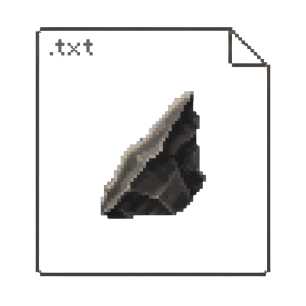

<h2 align="center">
 <b style="font-size:24px;line-height:24px;vertical-align:middle;"><i>dekronite  Flint</i></b>
</h2>

 

**Lightweight terminal text editor — written in C.**
*Status: work in progress*

---

## `TODO`

- [ ] Complete core editor
- [ ] Add extended functions
- [ ] Make configurable via `.conf` / `.json`
- [ ] Cross compatibility - make it work on unix systems
---
(instead of making this look cool, i should've actually coded smth)
## Contact
- (looking for contributors)
- Discord: 5a4n
- GitHub Issues for bugs and feature requests